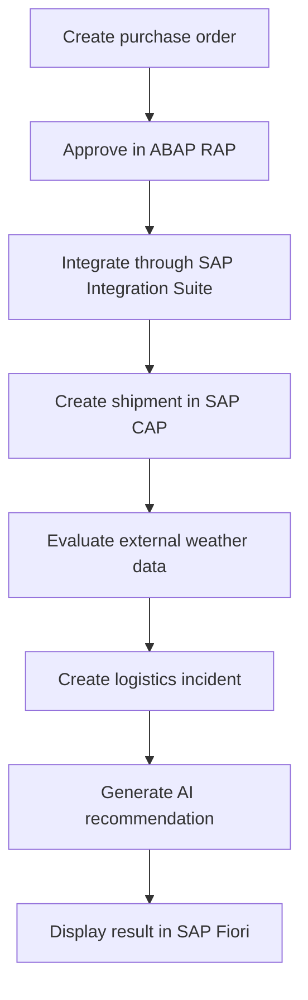

# SmartLogistics BTP

> AI-powered supply chain management platform built on SAP Business Technology Platform.

[](#project-status)
[](https://www.sap.com/products/technology-platform.html)
[](LICENSE)

SmartLogistics BTP is an end-to-end portfolio project for **GreenFields Foods**, a fictional agri-food company. It connects procurement, shipment tracking, external weather information, incident management, and grounded AI recommendations in one SAP BTP solution.

The project demonstrates how ABAP Cloud, SAP CAP, SAP Integration Suite, SAP Fiori, generative AI, and SAP BTP administration can be combined using clear system boundaries and clean-core principles.

## Business scenario

GreenFields Foods purchases agricultural products from suppliers and distributes them to warehouses. A procurement manager creates and approves a purchase order in the ABAP Cloud core. Integration Suite transfers the approved order to a CAP side-by-side extension, where a shipment is created and tracked. Weather information can trigger an incident, which is analyzed by generative AI and presented to a logistics manager in SAP Fiori.

## End-to-end flow



## Solution responsibilities

| Layer | Technology | Responsibility |
|---|---|---|
| Transactional core | ABAP Cloud, CDS, RAP | Suppliers, products and purchase orders |
| Side-by-side extension | SAP CAP, Node.js | Shipments, tracking events, incidents and AI recommendations |
| Persistence | SAP HANA Cloud | Extension-owned logistics data |
| Integration | SAP Integration Suite | Order synchronization, weather integration, mapping and error handling |
| User experience | SAP Fiori elements, SAPUI5 | Procurement, logistics and AI assistant applications |
| Intelligence | SAP Generative AI | Incident analysis, recommendations, grounding and RAG |
| Platform | SAP BTP, Cloud Foundry | Services, security, roles, destinations and deployment |

## MVP scope

Version 1.0 is complete when the solution can:

- create suppliers and products;
- create a purchase order with items;
- calculate item and order totals;
- validate and approve the purchase order;
- integrate the approved order with CAP;
- create and update a shipment;
- record tracking events;
- obtain weather information;
- create a weather-related incident;
- generate an AI-supported analysis and recommendation;
- display the complete flow in SAP Fiori.

Warehouse management, inventory, invoicing, payments, real GPS tracking, IoT, blockchain, and predictive machine learning are deliberately outside the MVP.

## Repository structure

```text
smartlogistics-btp/
├── abap/                         # ABAP Cloud and RAP core
├── cap/                          # CAP logistics extension
├── fiori/                        # Fiori elements and SAPUI5 apps
├── integration/                  # Integration Suite artifacts and documentation
├── ai/                           # Prompts, evaluation and RAG assets
├── docs/                         # Scope, architecture, ADRs, roadmap and evidence
├── postman/                      # API collections and environments
├── CONTRIBUTING.md
├── LICENSE
└── README.md
```

## Documentation

- [Project scope](docs/project-scope.md)
- [Solution architecture](docs/architecture/solution-architecture.md)
- [Architecture boundaries](docs/decisions/ADR-001-system-boundaries.md)
- [Implementation roadmap](docs/roadmap.md)
- [Initial backlog](docs/backlog.md)
- [Naming conventions](docs/naming-conventions.md)

## Project status

**Phase 0 — Project foundation:** complete.

The functional scope, system boundaries, repository layout, architectural decision record, naming rules, roadmap, and initial backlog are defined. The next milestone is **Phase 1: preparing and verifying the SAP BTP development environment**.

## SAP certification coverage

| Certification | Project evidence |
|---|---|
| C_ABAPD | CDS, RAP business object, determinations, validations, actions, DCL and OData V4 |
| C_CPE | CAP, CDS, Node.js, OData V4, SAP HANA Cloud and Cloud Foundry |
| C_CPI | iFlows, mappings, routing, adapters, scripts and exception handling |
| C_AIG | Prompt engineering, incident analysis, grounding and RAG |
| C_ADBTP | Account model, entitlements, service instances, destinations, roles, XSUAA and trust |
| C_FIORD | SAP Fiori elements, SAPUI5 freestyle, annotations and launchpad content |

## License

This project is licensed under the [MIT License](LICENSE). SAP product names are trademarks of SAP SE or its affiliates. This independent portfolio project is not affiliated with or endorsed by SAP.
