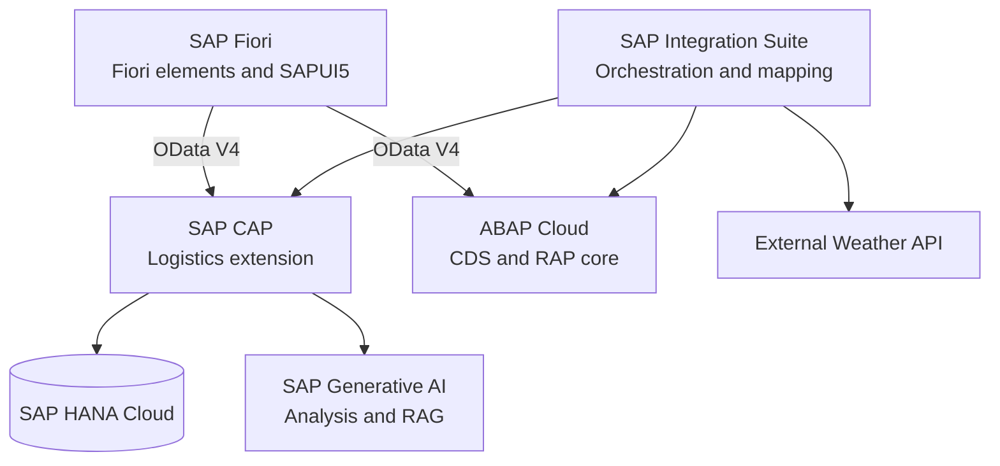

# Solution Architecture

## Logical architecture

## Data ownership

| System | Owned entities | Integration view of external data |
|---|---|---|
| ABAP Cloud | Supplier, Product, PurchaseOrder, PurchaseOrderItem | None in MVP |
| SAP CAP / HANA Cloud | Shipment, TrackingEvent, Incident, AIRecommendation | Purchase-order identifiers and required read-only context |
| External API | Weather observations or forecasts | Normalized weather-risk message |

The same business entity must not be independently writable in ABAP Cloud and CAP. CAP stores an order reference and the minimum snapshot required for traceability, while ABAP Cloud remains the source of truth for the purchase order.

## Principal integration flows

### `SL_ORDER_SYNC`

1. Obtain or receive an approved purchase order from ABAP Cloud.
2. Validate and filter its business status.
3. Map the purchase-order payload to the shipment-creation contract.
4. Create the shipment through the CAP API.
5. Handle, log and expose failures without silently losing the message.

### `SL_WEATHER_RISK`

1. Request weather data for the shipment destination or route proxy.
2. Normalize the external response.
3. Classify the risk using deterministic routing rules.
4. Create an incident in CAP when the threshold is reached.
5. Trigger AI analysis after the incident exists.

## Security model

- ABAP DCL and RAP feature control protect procurement data and actions.
- XSUAA scopes and role templates protect CAP APIs and UI applications.
- BTP role collections map business roles to application roles.
- Destinations encapsulate target URLs and authentication settings.
- Integration Suite security material stores credentials and certificates.
- Service keys are used only for development or integration scenarios that require them and are never committed.

## Deployment topology

The target landscape begins with a development subaccount and Cloud Foundry space. Shared services may be separated where the available SAP BTP account model permits it. Trial or free-tier constraints will be documented explicitly; mocks will preserve a runnable local demo when a commercial service is unavailable.
